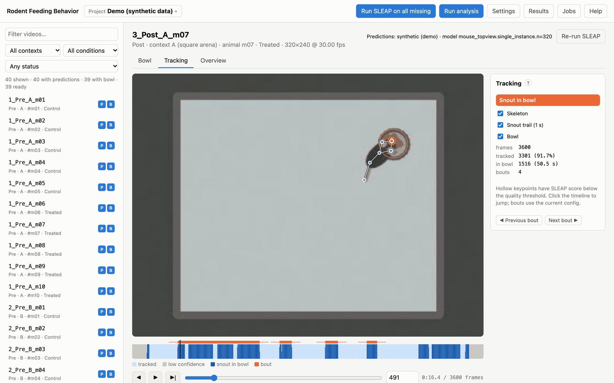

# Rodent Feeding Behavior

Measure how rodents feed, from video. You record an animal in an arena with a food bowl;
[SLEAP](https://sleap.ai) tracks its body parts; this tool turns the tracking into feeding bouts, behavioural
features, statistics and figures. Everything runs from a browser interface (or the command line) on your own
computer.



- **Projects** for your experiments: point to your videos, read animal, condition and arena from the file names, and
  assign groups.
- **SLEAP inference** from the app, with configurable `sleap-track` parameters and full provenance (model hashes,
  SLEAP version, exact command). Existing predictions can be imported instead.
- **Bowl annotation** per video: an ellipse (handles a tilted camera) or a free-form polygon.
- **Tracking review:** the skeleton, bowl and trail over the video, a timeline of tracked frames, contacts and bouts,
  and an overview sheet.
- **Bouts and features:** approach and withdrawal indirectness, returns, interaction time, speeds per body part and
  phase; per session: time at the bowl, latency, bouts per minute and locomotion.
- **Comparisons** of any groups you define (e.g. *Control vs Treated after treatment*, or *Pre vs Post in the same
  animals*), with paired tests when groups share animals, effect sizes, multiple-comparison correction, box plots,
  occupancy maps and Excel workbooks. They are re-run in seconds on an existing analysis.
- **Figures:** per-animal heatmaps and "tornado" trajectory plots, per-animal box plots of every feature, PCA/UMAP
  projections, local clustering and random-forest feature importances.
- **Reproducible:** every run records its settings, code version, package versions and input hashes; all randomness
  is seeded; `uv.lock` pins every dependency.
- **A synthetic demo project:** try everything without SLEAP or data of your own.

## Quick start

```bash
# 1. Install uv (https://docs.astral.sh/uv/)
curl -LsSf https://astral.sh/uv/install.sh | sh                                    # macOS / Linux
powershell -ExecutionPolicy ByPass -c "irm https://astral.sh/uv/install.ps1 | iex"  # Windows

# 2. Get the tool
git clone https://github.com/adamcatto/RodentFeedingBehavior.git
cd RodentFeedingBehavior
uv sync

# 3. Try the demo, then open http://127.0.0.1:8765
uv run feeding demo
uv run feeding serve projects/demo
```

Or start with `uv run feeding serve` and click **Try the demo project**. To analyse your own videos, choose
**Project ▾ → New project**.

It runs on macOS, Linux and Windows. Running SLEAP inference yourself needs SLEAP in its own conda environment, which
the tool finds automatically, and a trained single-animal (or top-down) model. See
[Installation](docs/manual/02-installation.md).

## Documentation

The user manual is in [`docs/manual`](docs/manual/01-introduction.md). It is also built into the app (**Help**) and
available as a Word document (`docs/Rodent-Feeding-Behavior-Manual.docx`).

| | |
|---|---|
| [Introduction](docs/manual/01-introduction.md) | what the tool does, concepts |
| [Installation](docs/manual/02-installation.md) | uv, the tool, SLEAP |
| [Quick start](docs/manual/03-quick-start.md) | a tour with the demo project |
| [Projects](docs/manual/04-projects.md) | creating projects, videos, naming patterns, groups |
| [SLEAP pose estimation](docs/manual/05-sleap.md) | models, inference, parameters, importing |
| [Annotating the bowl](docs/manual/06-bowls.md) | ellipse and polygon rims |
| [Reviewing the tracking](docs/manual/07-tracking.md) | tracking view, timeline, quality filtering |
| [Running the analysis](docs/manual/08-analysis.md) | bouts, features, session and locomotion measures |
| [Results](docs/manual/09-results.md) | the results page and figures |
| [Comparisons](docs/manual/10-comparisons.md) | defining groups to compare |
| [Statistical methods](docs/manual/11-statistics.md) | units, tests, effect sizes, corrections |
| [Configuration](docs/manual/12-configuration.md) | every `feeding.yaml` setting |
| [Command line](docs/manual/13-command-line.md) | every `feeding` command |
| [Output files](docs/manual/14-outputs.md) | run folders, manifest, reproducibility |
| [Behaviour embedding](docs/manual/15-embedding.md) | optional LSTM-VAE clustering |
| [Troubleshooting](docs/manual/16-troubleshooting.md) | common problems |

## Command line

```bash
uv run feeding init projects/my-cohort --videos /data/videos --model /models/mouse.single_instance.n=300
uv run feeding check   -p projects/my-cohort
uv run feeding infer   -p projects/my-cohort --all --batch-size 8
uv run feeding analyze -p projects/my-cohort
uv run feeding compare -p projects/my-cohort
```

## Development

```bash
uv sync --all-extras
uv run pytest                          # unit tests + end-to-end tests on synthetic data
uv run python scripts/build_manual.py  # rebuild the Word manual from docs/manual (needs pandoc)
```

```
src/feeding/
  config.py project.py settings.py    project format, creation, checks, app-wide defaults
  naming.py poses.py tracks.py         file-name metadata, SLEAP files, quality filtering, contact
  bowl.py bouts.py features.py         bowl geometry, bout detection, features
  stats.py views.py exploratory.py     comparisons and statistics, exploratory analyses
  plots.py pipeline.py                 figures, the analysis run
  sleap_runner.py video.py             SLEAP inference, video reading and splitting
  embedding.py demo.py docs.py         optional embedding, synthetic demo, in-app manual
  cli.py                               the `feeding` command
  server/                              FastAPI backend + static browser UI (no build step)
docs/manual/                           the user manual (Markdown + screenshots)
scripts/build_manual.py                Word version of the manual
tests/
```

The browser UI is plain HTML, CSS and JavaScript served by FastAPI. The server runs SLEAP and analyses as background
jobs, one at a time.

## Citation and license

If you use the tool in published work, please cite it ([CITATION.cff](CITATION.cff), or **Cite this repository** on
GitHub) together with [SLEAP](https://sleap.ai).

Licensed under BSD 3-Clause; see [LICENSE](LICENSE). You may use, modify and redistribute the code, in academic or
any other work, provided the copyright notice is kept.
