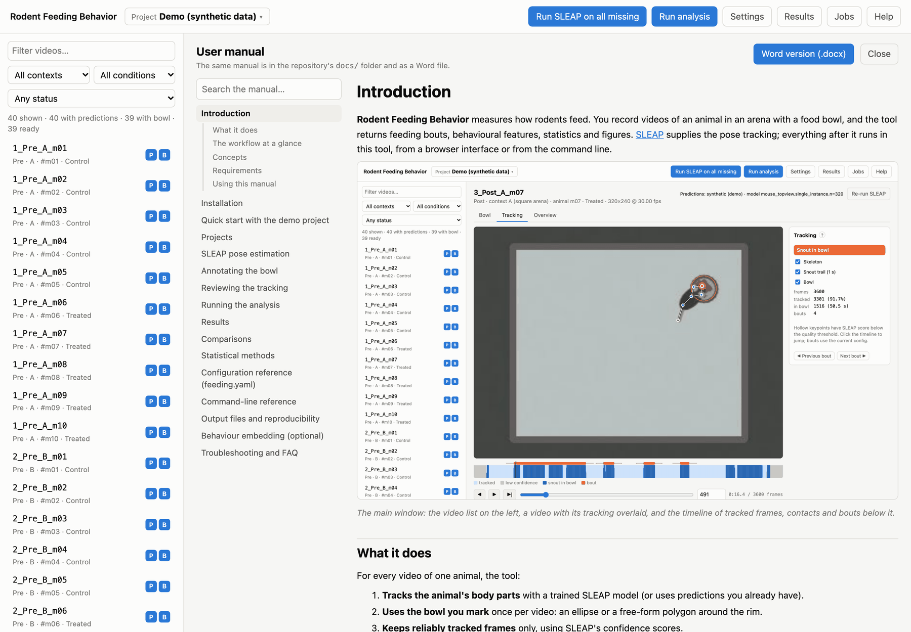

# Introduction

**Rodent Feeding Behavior** measures how rodents feed. You record videos of an animal in an arena with a
food bowl, and the tool returns feeding bouts, behavioural features, statistics and figures.
[SLEAP](https://sleap.ai) supplies the pose tracking; everything after it runs in this tool, from a browser
interface or from the command line.

*The main window: the video list on the left, a video with its tracking overlaid, and the timeline of tracked frames,
contacts and bouts below it.*

## What it does

For every video of one animal, the tool:

1. **Tracks the animal's body parts** with a trained SLEAP model (or uses predictions you already have).
2. **Uses the bowl you mark** once per video: an ellipse or a free-form polygon around the rim.
3. **Keeps reliably tracked frames** only, using SLEAP's confidence scores.
4. **Finds feeding bouts**: stretches in which the snout (or another keypoint you choose) is inside the bowl rim,
   including brief step-backs ("returns"), with an approach before and a withdrawal after.
5. **Measures each bout**: how directly the animal approached and left, how long it fed, how often it returned,
   and how fast each body part moved in each phase.
6. **Summarises each session**: time at the bowl, latency to the first contact, bouts per minute, distance travelled,
   speed, time spent moving and distance kept from the bowl.
7. **Compares groups** that you define (e.g. *Control vs Treated after treatment*, or *Pre vs Post in the same
   animals*). Each comparison gets the appropriate tests, effect sizes, multiple-comparison corrections, box plots and
   occupancy maps.
8. **Draws figures**: per-animal heatmaps and "tornado" trajectory plots, comparison figures, PCA/UMAP projections and
   per-animal box plots. A run can be exported as one zip file.

Every analysis run is saved in its own folder with a manifest. The manifest records the exact settings, code version,
package versions and hashes of every input, so any result can be traced back and reproduced.

## The workflow at a glance

| Step | Where | Chapter |
|---|---|---|
| Install the tool (and SLEAP, if you will run inference) | terminal | [Installation](02-installation.md) |
| Try everything on synthetic data | *Try the demo project* | [Quick start](03-quick-start.md) |
| Create a project from your videos | *Project ▾ → New project* | [Projects](04-projects.md) |
| Assign a SLEAP model and run inference | *Settings*, *Run SLEAP* | [SLEAP pose estimation](05-sleap.md) |
| Mark the bowl in every video | *Bowl* tab | [Annotating the bowl](06-bowls.md) |
| Check the tracking | *Tracking* and *Overview* tabs | [Reviewing the tracking](07-tracking.md) |
| Analyse | *Run analysis* | [Running the analysis](08-analysis.md) |
| Read results, export | *Results* | [Results](09-results.md) |
| Compare any groups | *Results → Comparisons* | [Comparisons](10-comparisons.md) |

## Concepts

**Project.** A folder with a `feeding.yaml` file. It names the videos, the SLEAP model(s) and all analysis settings, and it holds your annotations and results. One project usually holds one cohort or experiment. See [Projects](04-projects.md).

**Video.** One recording of **one animal**. If you film several animals at once (e.g. four arenas in one camera view), split the recording into one video per animal first (see `feeding split` in the [command-line reference](13-command-line.md)).

**Animal, condition, context, session.** Read from each video's **file name** using a naming pattern, e.g. `3_Post_A_m12` → session 3, condition *Post*, context *A*, animal *m12*. *Condition* is the experimental state (e.g. *Pre*/*Post*, *Baseline*/*Drug*); *context* is usually the arena or chamber. See [Naming videos](04-projects.md#naming-videos).

**Group.** A label per animal (e.g. *Control*, *Treated*, a genotype or diet), entered in the app or in `metadata/subjects.csv`.

**Bout.** One visit to the food. It is a run of contact with the bowl, possibly with brief step-backs, plus an approach window before it and a withdrawal window after. See [Contact and bouts](08-analysis.md#contact-and-bouts).

**Comparison (view).** Two or more groups of videos defined by their metadata, and which pairs of them to test. A *Standard* comparison is built automatically. See [Comparisons](10-comparisons.md).

**Run.** One execution of the analysis, saved as `data/results/<date-time>_<settings-hash>/`. See [Output files](14-outputs.md).

## Requirements

- macOS, Linux or Windows, with Python 3.11 or newer (installed for you by `uv`).
- A recent browser (Chrome, Firefox, Safari or Edge). The app runs locally; nothing is uploaded anywhere.
- To run pose estimation: SLEAP in its own environment, plus a trained SLEAP model for your camera setup. A GPU makes
  inference much faster but is not required. Without SLEAP you can still import predictions made elsewhere and use
  everything else.

## Using this manual

The manual is also built into the app: click **Help** in the top bar, or press <kbd>?</kbd>. The **?** buttons next to
section titles (in Settings, the Bowl and Tracking panels, Results and the comparison editor) open the matching part.
The search box finds every section that mentions all the words you type. **Word version (.docx)** downloads the same
manual as one document for printing or offline reading.

*Help: chapters and sections on the left, with search; the chapter on the right.*
