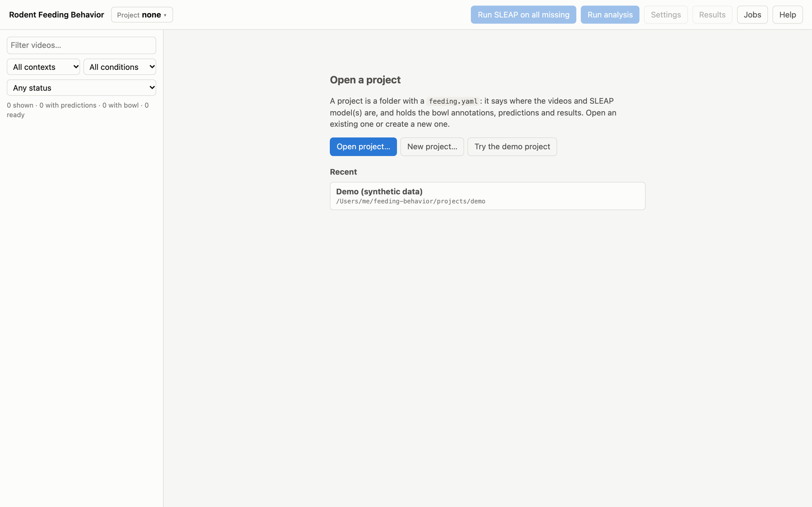
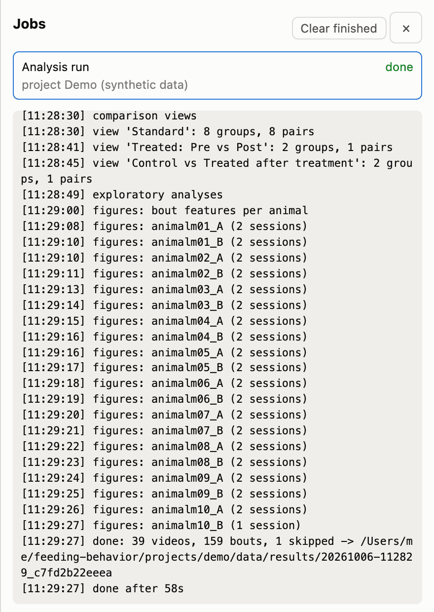
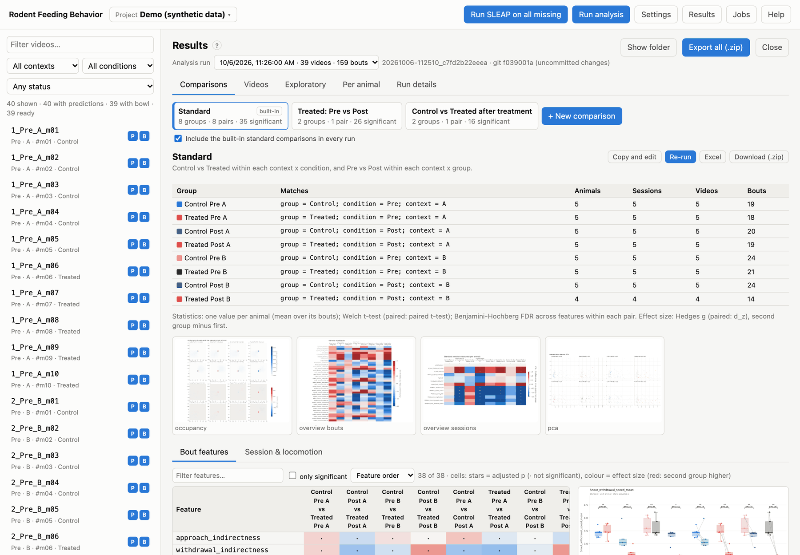
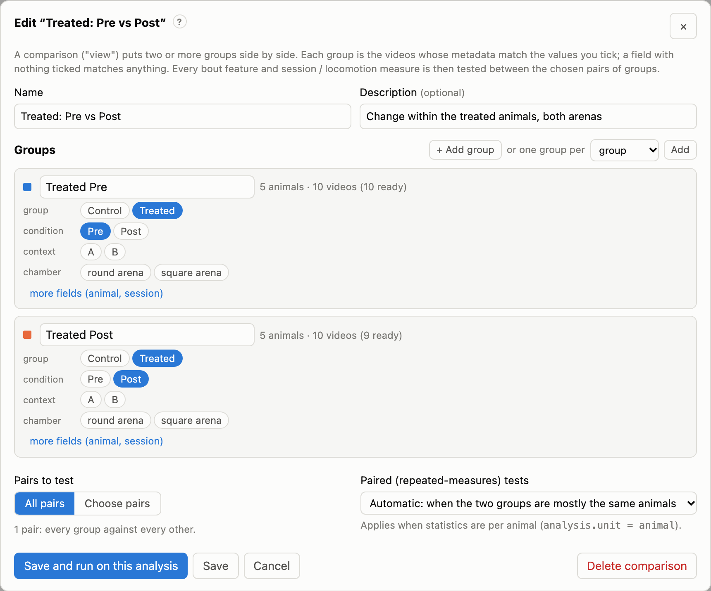

# Quick start with the demo project

The demo project lets you try every step in about ten minutes, without SLEAP and without your own data. It contains
synthetic videos of a simulated mouse, with SLEAP-format predictions:

- **10 animals:** 5 *Control* (m01–m05) and 5 *Treated* (m06–m10).
- **4 sessions each:** *Pre* and *Post*, each in a square arena (context *A*) and a round arena (context *B*).
- **40 videos** of 2 minutes, named `{session}_{condition}_{context}_{animal}`, e.g. `3_Post_A_m07`.
- **Built-in effects:** in *Post* sessions, Treated animals visit the bowl more often, feed longer, step back and
  return more, and move more slowly. The analysis should find these differences.

## 1. Create and open the demo

Start the app (`uv run feeding serve`) and open <http://127.0.0.1:8765>. On the start page, click
**Try the demo project**. It takes about 20 seconds to render the videos.



*The start page, shown when no project is open: open a project, create one, or try the demo.*

The same from a terminal:

```bash
uv run feeding demo                 # creates projects/demo
uv run feeding serve projects/demo
```

## 2. Look around

The **video list** on the left shows every video with two badges:

- **P**: SLEAP predictions exist. A video that is being processed shows a progress bar.
- **B**: the bowl is annotated.

Filter the list by name, context, condition or status ("needs predictions", "needs bowl", "ready"). The line under
each name shows its condition, context, animal and group, all read from the file name and the groups table.

Click a video. It opens in the **Tracking** tab: the video frame with the tracked skeleton, the bowl outline and a
one-second snout trail. Press <kbd>Space</kbd> to play; the timeline below shows tracked frames, snout-in-bowl frames
and the detected bouts.


*Tracking tab: skeleton, bowl rim (orange) and snout trail. On the timeline, light blue = tracked, grey = low
confidence (excluded), dark blue = snout in the bowl, orange bars = bouts.*

## 3. Annotate a bowl

The demo comes with every bowl already marked. To try annotating, open a video's **Bowl** tab, click **Delete**, and
mark it again: click the centre of the bowl, then its top, bottom, left and right edges. Then click **Save bowl**. See
[Annotating the bowl](06-bowls.md) for polygons, keyboard shortcuts and copying a bowl between videos.


*Bowl tab: the five points of an elliptical rim, with tools to move, rotate and resize it.*

## 4. Run the analysis

Click **Run analysis** in the top bar. The job appears in the **Jobs** drawer, with its log. On the demo it takes
about a minute: every video is processed, the comparisons are computed, and the figures are drawn.



*The Jobs drawer: queued, running and finished jobs, with the log of the selected one.*

## 5. Read the results

When the job is done, click **Results**. The **Comparisons** tab opens on the *Standard* comparison:

- Control vs Treated within each arena and condition;
- Pre vs Post within each arena and group.

The grid lists every feature (rows) against every pair of groups (columns). Stars mark significance after correction
for multiple comparisons, and the colour shows the effect size. Click a row to see its box plot and the numbers
behind it.



*Results → Comparisons, Standard comparison: the groups it matched, figure thumbnails, and (below) the statistics grid;
click any row for its box plot.*

Then explore the other tabs:

- **Videos:** the numbers per video.
- **Exploratory:** per-animal box plots of every feature, PCA and UMAP projections, a local-clustering test and a
  random forest that tells Pre from Post.
- **Per animal:** heatmaps and tornado plots of each animal's sessions.
- **Run details:** the exact settings and software versions.

**Export all (.zip)** downloads everything; **Show folder** opens the run folder.

## 6. Make your own comparison

Click **+ New comparison**. Here is an example that compares Pre and Post in Treated animals, pooling both arenas:

1. Name it *Treated: Pre vs Post*.
2. In the first group, tick *group = Treated* and *condition = Pre*.
3. In the second group, tick *group = Treated* and *condition = Post*.
4. Click **Save and run on this analysis**. It runs in a few seconds; there is no need to re-analyse the videos.

Because both groups contain the same five animals, the tests are automatically *paired*. See
[Comparisons](10-comparisons.md).



*The comparison editor: each group is the set of videos whose metadata match the ticked values.*

## Next steps

- Set up your own project: [Projects](04-projects.md).
- Run SLEAP on your videos: [SLEAP pose estimation](05-sleap.md).
- Understand exactly what is measured: [Running the analysis](08-analysis.md) and
  [Statistical methods](11-statistics.md).
