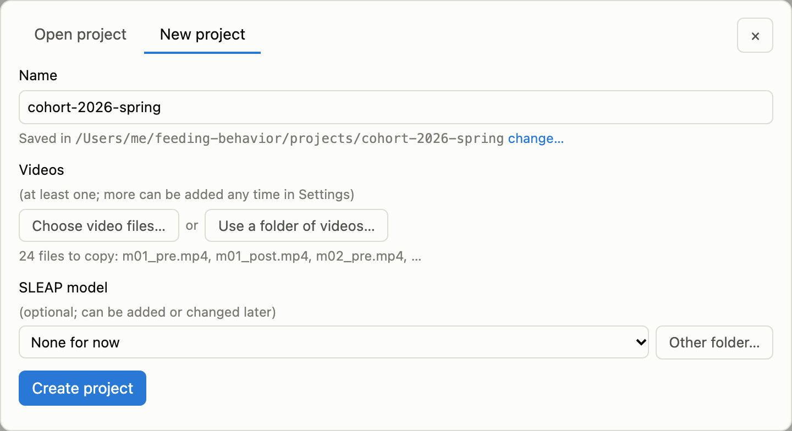
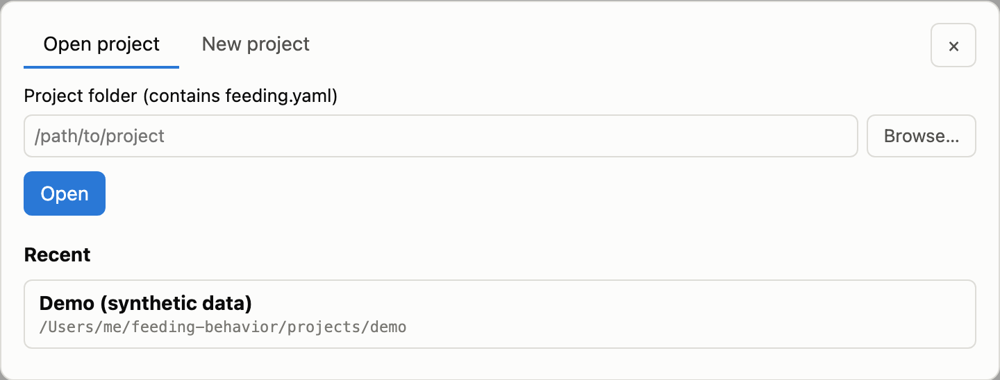
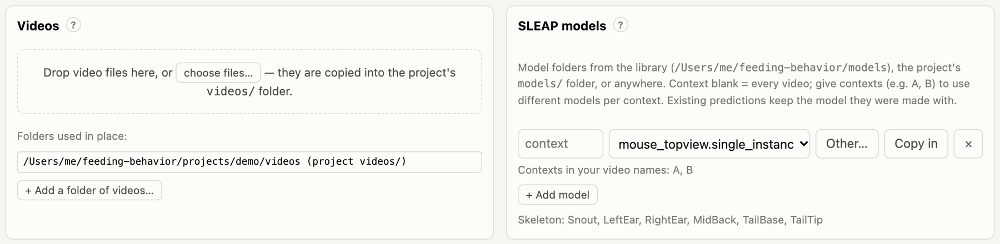
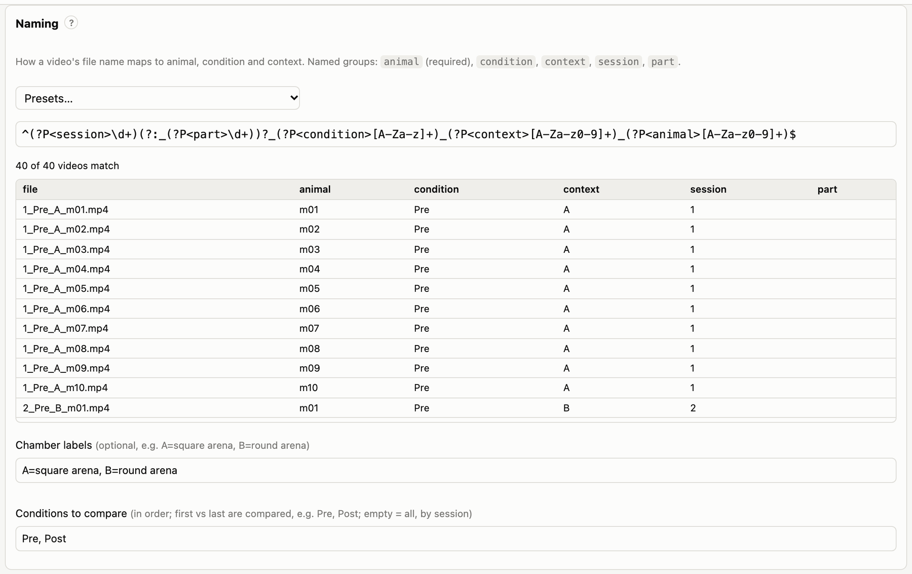
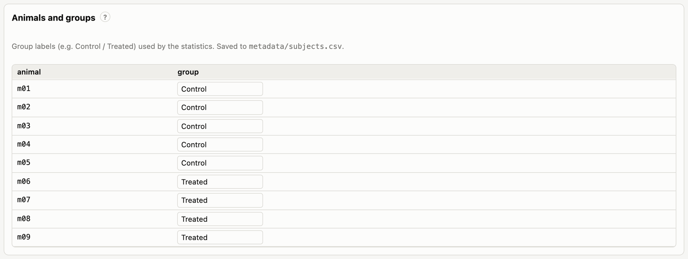

# Projects

Everything happens inside a **project**: a folder with a `feeding.yaml` configuration file. A project knows where
its videos are, which SLEAP model to use, how to read metadata from file names and which group each animal is in. It
also holds your bowl annotations, the predictions and every analysis run.

A project can start with just a name and one video, and grow later: you can add videos, assign models and set groups
at any time.

## Creating a project

Click **Project ▾** in the top bar (or **New project…** on the start page) and choose **New project**.



*New project: a name and some videos are all that is needed.*

1. **Name.** The project folder is created under the projects folder (shown below the name; **change…** picks
   another place).
2. **Videos:**
   - **Choose video files…** copies the files into the project's `videos/` folder.
   - **Use a folder of videos…** leaves the videos where they are and reads them in place (the folder is never
     written to).
3. **SLEAP model** (optional). Pick a model from the library, or **Other folder…** for any model folder. You can also
   add it later.
4. Click **Create project**. The naming pattern is guessed from the file names; check it in *Settings → Naming*.

From a terminal:

```bash
feeding init projects/my-cohort --videos /data/cohort1/videos --model /models/mouse.single_instance.n=300
feeding init projects/my-cohort          # barebones; add everything later
```

## Opening and switching projects

**Project ▾ → Open project** takes a project folder (type it, or **Browse…**) and lists recently opened projects. The
current project's name is shown in the top bar; hover over it to see its path and settings hash.



*Open project, with the recent-projects list.*

`feeding serve PROJECT` opens a project straight away. Without an argument, `feeding serve` opens the project in the
current folder (or a parent folder) if there is one.

Problems that would stop or degrade the analysis are shown in a bar under the top bar. Examples: a missing videos
folder, no model for a context, animals without a group, SLEAP not found. The same checks run with `feeding check`.

## The project folder

```
my-cohort/
  feeding.yaml              configuration (the only required file)
  videos/                   videos copied into the project (more folders can be used in place)
  models/                   SLEAP models copied into the project (optional)
  metadata/subjects.csv     animal → group
  annotations/bowls/        one JSON file per video, written by the Bowl tab
  data/                     generated: predictions, cached tracks, results, logs
```

Relative paths in `feeding.yaml` are relative to the project folder, so a project can be moved or shared as a whole.
Videos referenced in place from elsewhere are stored with their absolute path.

## Project settings

**Settings** (top bar) edits the open project. Changes are written to `feeding.yaml` when you click **Save**. Comments
and formatting in the file are kept, and settings are checked before they are saved, so an invalid value is rejected
with a message and the file is left unchanged.

### Adding videos



*Settings → Videos and SLEAP models.*

There are three ways to add videos:

- **Drop video files** on the drop zone, or **choose files…**. They are copied into the project's `videos/` folder;
  on the machine running the server this opens the system's file chooser.
- **+ Add a folder of videos…** uses a folder in place. Use this for large collections, network drives or read-only
  archives.
- From a terminal: `feeding add-videos FILES_OR_FOLDERS…` (files are copied; folders are used in place).

Supported formats are `.mp4`, `.avi`, `.mov`, `.mpg` and `.mkv`. Every video must show **one animal**. For accurate
frame-by-frame review, use a codec with frequent keyframes. `feeding split` produces such files when it splits
multi-arena recordings.

### Naming videos

The tool reads each video's metadata from its file name with a **naming pattern**: a regular expression with named
groups.



*Settings → Naming: a pattern, presets, and a live preview of how every file name is read.*

| Named group | Meaning | Required |
|---|---|---|
| `animal` | animal ID; links videos to groups | yes |
| `condition` | experimental condition (e.g. Pre/Post, Baseline/Drug) | no |
| `context` | arena, chamber or apparatus; can select a model per context | no |
| `session` | session number; orders sessions chronologically | no |
| `part` | part number when one session was recorded in several files | no |

Missing fields become `NA`. Files whose names don't match are listed in the preview and **ignored**.

Presets:

| Preset | Example file name |
|---|---|
| `{session}[_{part}]_{condition}_{context}_{animal}` (default) | `3_Post_A_m12.mp4`, `7_2_Pre_B_m04.mp4` |
| whole file name is the animal | `mouse12.mp4` |
| `{animal}_{condition}` | `m12_baseline.mp4` |
| `{animal}_{condition}_{context}` | `m12_baseline_boxA.mp4` |

For other schemes, write your own pattern. For example, `cohort2-m12-day3-fasted.mp4` is read by:

```
^cohort2-(?P<animal>m\d+)-day(?P<session>\d+)-(?P<condition>\w+)$
```

The preview updates as you type. **Chamber labels** give contexts readable names (e.g. `A=square arena, B=round arena`),
used in the video list and in figures.

**Conditions to compare** sets which conditions enter the statistics, in experimental order, e.g. `Pre, Post`. The
standard comparison contrasts the first with the last. Leave it empty to use every condition, ordered by session
number.

> **Sessions in several parts.** If a session was recorded as several files (named with a `part`), the parts are
> combined into one session for the session measures: counts and durations are added, and averages are weighted by
> the number of tracked frames. Each part is still annotated and processed as its own video.

### Animals and groups



*Settings → Animals and groups: one group label per animal.*

Type a group for each animal (e.g. *Control*, *Treated*); labels you have used are suggested. Animals without a
group are still analysed, but they are left out of group comparisons. Groups are saved in `metadata/subjects.csv`:

```csv
animal,group
m01,Control
m02,Treated
```

You can also edit this file directly, e.g. paste it from a spreadsheet. Animal IDs are compared as text, so `7` and
`07` are different animals.

## What to keep, share and back up

The files you create by hand are `feeding.yaml`, `metadata/subjects.csv` and `annotations/bowls/*.json`. Together
with the videos, the predictions and the code version, they fully determine every result. Everything under `data/` is
generated; most of it can be recreated, but SLEAP predictions take time to recompute, so back them up.

A new project gets a `.gitignore` that excludes `data/`, so the project folder itself can be put under version
control.
