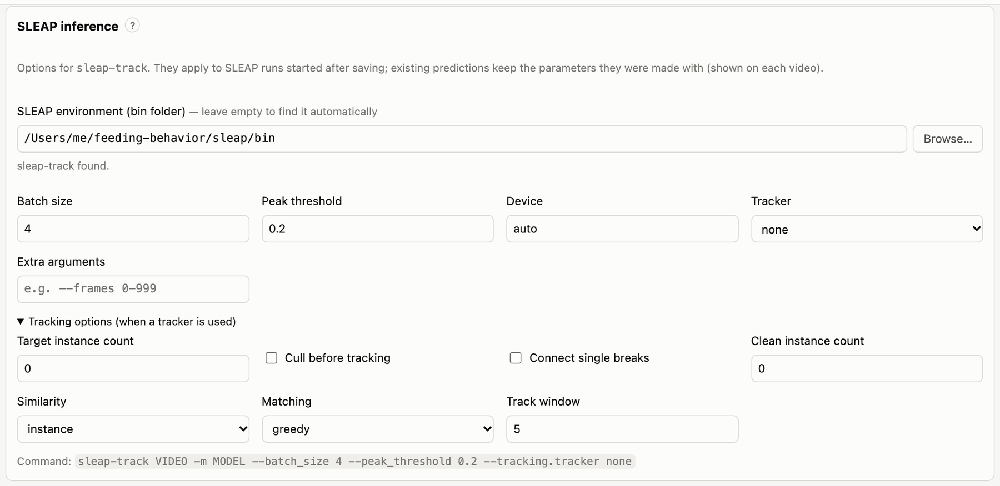

# SLEAP pose estimation

[SLEAP](https://sleap.ai) finds the animal's body parts (keypoints) in every frame. This tool runs SLEAP's
`sleap-track` for you, converts the result to an analysis file, and records exactly how it was made. You need SLEAP
installed (see [Installation](02-installation.md#4-install-sleap-for-running-inference)) and a trained model.

## Models

A SLEAP model is a folder containing `training_config.json` and `best_model.h5`, produced by training in SLEAP. The
pipeline analyses **one animal per video**, so use either:

- a **single-instance** model (`…single_instance…`), or
- a **top-down** pair: a `centroid` model plus a `centered_instance` model, given together.

Any skeleton works. The keypoint names are read from the model, and the analysis settings that name keypoints (which
keypoint defines contact with the bowl, which are ignored, which are used for speeds) are filled in from it. The
defaults suit a skeleton with a `Snout`; for other skeletons the first keypoint is used, and you can change it in
`feeding.yaml` (see [Configuration](12-configuration.md#bouts)).

### Assigning a model

In **Settings → SLEAP models**, choose a model in the list and click **Save**. The list contains:

- models in the **model library**: the `models/` folder of the app, or the folders in `FEEDING_MODEL_LIBRARY`;
- models in the project's own `models/` folder;
- anything you pick with **Other…**.

**Copy in** copies a model into the project, so the project stays complete when moved to another computer.

**One model per context.** If your contexts look different on camera (e.g. a square and a round arena), you may have
trained a model for each. Add one row per context and type the context name (e.g. `A`, `B`) in the first box. A row
with an empty context applies to every video without its own model. For a top-down pair, add two rows with the same
context.

From a terminal:

```bash
feeding models                                   # list the models in the library
feeding set-model /models/mouse.single_instance.n=300
feeding set-model A=/models/square.n=250 B=/models/round.n=270
feeding set-model /models/m.centroid.n=200 /models/m.centered_instance.n=200   # top-down pair
```

To add a model to the library, copy or link its folder into `models/`:

```bash
ln -s /path/to/mouse.single_instance.n=300 models/
```

## Running inference

- **One video:** select it and click **Run SLEAP** in its header. If it already has predictions, the button says
  **Re-run SLEAP** and asks before overwriting.
- **All videos without predictions:** **Run SLEAP on all missing** in the top bar.

Jobs run one at a time in the background. Their progress shows in the video list and in the **Jobs** drawer, which
also has each job's full log and a **Cancel** button. Closing the browser does not stop them; stopping the server
does. An interrupted video never leaves a half-written file behind: outputs are written under temporary names and
renamed only when complete.

From a terminal:

```bash
feeding infer 3_Post_A_m12 4_Post_B_m12      # some videos
feeding infer --all                          # every video without predictions
feeding infer --all --force                  # every video, overwriting
```

For each video the predictions folder (`data/predictions/` by default) receives:

| File | Contents |
|---|---|
| `<video>.slp` | SLEAP's own predictions file (open it in SLEAP to inspect or correct) |
| `<video>.analysis.h5` | keypoint coordinates and confidence scores per frame: what the analysis reads |
| `<video>.provenance.json` | how the predictions were made (see below) |

## Inference parameters

**Settings → SLEAP inference** sets the options passed to `sleap-track`. They apply to inference started after you
save; existing predictions keep the settings they were made with.



*Settings → SLEAP inference: the SLEAP environment, the main options, tracking options, and a preview of the command.*

| Setting | `sleap-track` option | Default | Meaning |
|---|---|---|---|
| SLEAP environment | – | found automatically | the `bin` folder of the conda environment with SLEAP |
| Batch size | `--batch_size` | 4 | frames predicted at once. Larger is faster but needs more (GPU) memory; lower it after out-of-memory errors |
| Peak threshold | `--peak_threshold` | 0.2 | minimum confidence for a keypoint to be detected (0–1). Lower finds more keypoints, including more wrong ones |
| Device | `--cpu` / `--first-gpu` / `--gpu N` | auto | *auto* lets SLEAP choose; *cpu*, *gpu* (first GPU) or a GPU number |
| Tracker | `--tracking.tracker` | none | links detections across frames. *none* is right for one animal per video; *simple* or *flow* (optical flow) for several animals |
| Extra arguments | – | none | passed to `sleap-track` as written, after the options above, and override them (e.g. `--frames 0-8999`) |

When a tracker is used, more options appear under **Tracking options**:

| Setting | `sleap-track` option | Default |
|---|---|---|
| Target instance count | `--tracking.target_instance_count` | 0 (no limit) |
| Cull before tracking | `--tracking.pre_cull_to_target` | off |
| Connect single breaks | `--tracking.post_connect_single_breaks` | off |
| Clean instance count | `--tracking.clean_instance_count` | 0 (off) |
| Similarity | `--tracking.similarity` | instance (or centroid, iou) |
| Matching | `--tracking.match` | greedy (or hungarian) |
| Track window | `--tracking.track_window` | 5 frames |

The bottom of the panel shows the resulting command line. In `feeding.yaml` the same settings are under `sleap:`:

```yaml
sleap:
  bin_dir: null            # null = find SLEAP automatically
  models: {default: models/mouse.single_instance.n=300}
  batch_size: 8
  peak_threshold: 0.2
  device: auto
  tracker: none
  extra_args: []
```

On the command line, `feeding infer` accepts the main options for one run. `--save` also stores them in the project:

```bash
feeding infer --all --batch-size 16 --device 0
feeding infer --all --peak-threshold 0.3 --save
feeding infer 3_Post_A_m12 --sleap-arg=--frames --sleap-arg=0-899      # any other sleap-track option
feeding config sleap                       # show the SLEAP settings
feeding config sleap.batch_size 16         # change one
```

When a video's predictions were made with a different model or different parameters than the current settings, its
header says so (e.g. *made with different SLEAP settings (peak_threshold)*). Re-run SLEAP on it if you want them
updated.

## Importing existing predictions

If you already have SLEAP analysis files (`.h5`, exported with *File → Export Analysis HDF5* in SLEAP or with
`sleap-convert --format analysis`), import them instead of re-running inference:

```bash
feeding import-predictions /path/to/folder/with/h5/files
```

A file named `<video>.h5` or `<video>.analysis.h5` is matched to the video with that name. Before it is copied (never
moved), the import checks that its keypoint names match the project's skeleton and that it is not longer than the
video. Imported predictions are marked as such in their provenance file.

## Provenance

Each `<video>.provenance.json` records:

- the source: a SLEAP run, an import, or the demo;
- the hash of the video file;
- the model folders, with hashes of their weights;
- the SLEAP version;
- the inference parameters and the exact commands that were run;
- start and end times.

Each analysis run copies this information into its manifest, so a result can always be traced back to the model and
settings that produced its poses.
