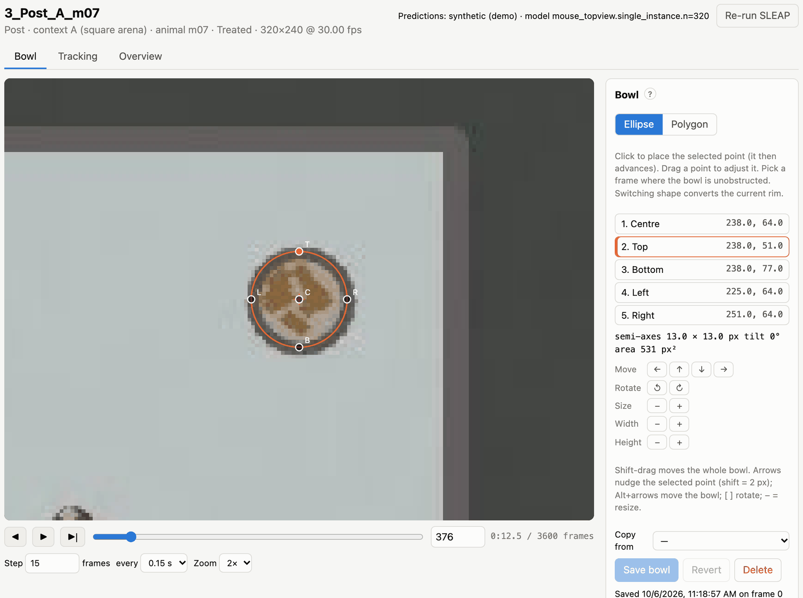
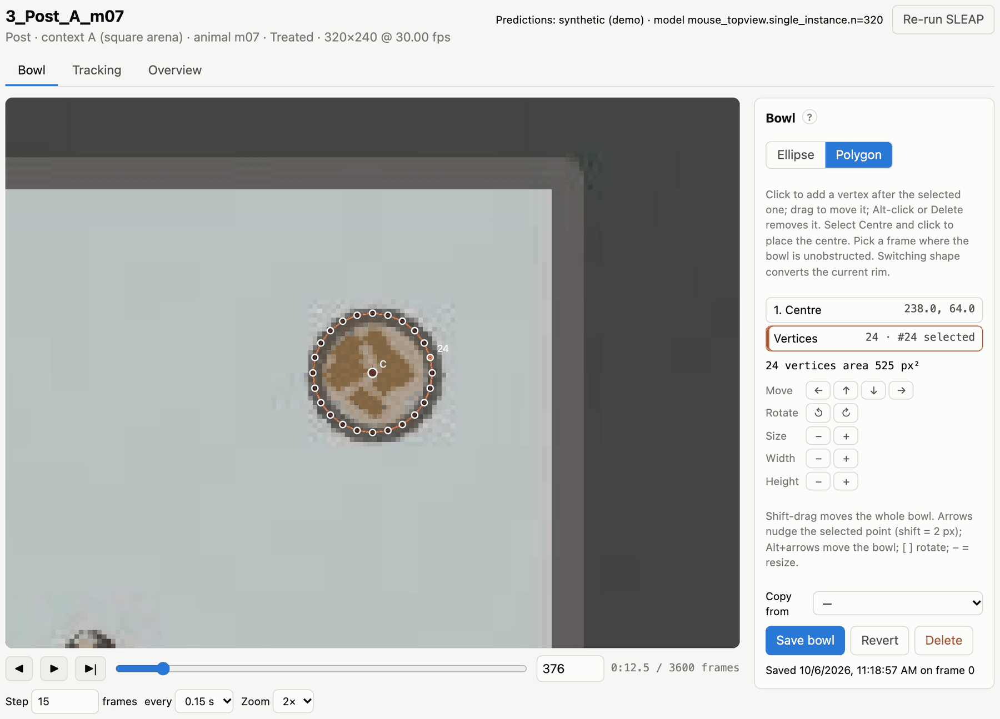

# Annotating the bowl

The analysis needs to know where the food is in every video. You mark it once per video in the **Bowl** tab. The
annotation has two parts:

- **The centre** is the *feeding origin*. Distances to the bowl and approach headings are measured to it.
- **The rim** decides contact: the snout (or the keypoint you chose) is *in the bowl* when it is inside the rim.
  The rim can be an **ellipse** or a **polygon**.

The camera may be tilted, so a round bowl often looks like a tilted ellipse in the image; the ellipse tool handles
that. Use a polygon for bowls that are not elliptical, or that are partly hidden behind a wall or a feeder.

## Marking an ellipse

*Marking an elliptical rim: centre, top, bottom, left and right. The panel shows the fitted semi-axes, tilt and area.*

1. Pick a frame where the bowl is fully visible: drag the slider, or use the arrow buttons and the frame box. The view
   is zoomed in by default; change it with **Zoom**.
2. Make sure **Ellipse** is selected. Then click, in this order: the **centre** of the bowl, and its **top**,
   **bottom**, **left** and **right** edges. After each click the next point is selected; the list on the right shows
   which point is next.
3. The fitted rim is drawn as you go. Drag any point to adjust it, or select a point in the list (or press
   <kbd>1</kbd>–<kbd>5</kbd>) and click again to place it.
4. Click **Save bowl**.

The four rim points are the rim's outermost points in the image (highest, lowest, leftmost, rightmost). They determine
the ellipse exactly, including its tilt. Place them on the rim's *outer edge* as it appears on screen; they don't need
to be opposite each other.

## Marking a polygon

*A polygon rim: click around the visible edge of the bowl.*

1. Click **Polygon**. If an ellipse was already marked, it is converted to a polygon that you can edit.
2. Select **Centre** in the list and click to place the centre.
3. Click around the rim to add corners. Each new corner is inserted after the selected one, so you can also add a
   corner in the middle of an edge: select the corner before it, then click.
4. Drag a corner to move it. <kbd>Alt</kbd>-click it, or select it and press <kbd>Delete</kbd>, to remove it.
5. Click **Save bowl**.

Contact with a polygon is decided the same way: the keypoint must be inside the polygon.

## Moving, rotating and resizing

The tools under the point list change the whole rim:

| Action | Buttons | Keys |
|---|---|---|
| Move the whole bowl | ← ↑ ↓ → under *Move*, or <kbd>Shift</kbd>-drag | <kbd>Alt</kbd>+arrows |
| Nudge the selected point | – | arrows (<kbd>Shift</kbd> = 2 px) |
| Rotate | ↺ ↻ | <kbd>[</kbd> <kbd>]</kbd> (3° steps) |
| Resize | − + under *Size* | <kbd>−</kbd> <kbd>=</kbd> |
| Stretch | *Width* and *Height* − + | – |
| Select an ellipse point | click it in the list | <kbd>1</kbd>–<kbd>5</kbd> |
| Remove a polygon corner | – | <kbd>Alt</kbd>-click, or <kbd>Delete</kbd> |

**Revert** discards unsaved changes; **Delete** removes the saved annotation.

## Copying a bowl from another video

When the camera and bowl did not move between recordings, start from an existing annotation. In **Copy from**, pick
another video (the same animal in the same context is listed first, then other videos of that context), check the rim against this video's frame,
adjust it if needed, and save.

## Tips

- **Choose a frame without the animal on the bowl**, ideally a frame in which the bowl is clearly lit.
- **Check one frame late in the video** as well. If the bowl was pushed during the recording, the rim no longer fits.
  The analysis assumes the bowl doesn't move within a video.
- **Mark the rim where the animal can reach the food.** Contact means "the keypoint is inside the rim", so a rim drawn
  too large counts sniffing next to the bowl as feeding. You can tune this afterwards: `bouts.margin_px` in
  `feeding.yaml` grows (positive) or shrinks (negative) the rim for the contact test without changing the annotations.
- **Use Tracking to check the result.** It shows the rim with the snout and colours the timeline wherever the snout is
  inside. See [Reviewing the tracking](07-tracking.md).

## Where annotations are stored

Each bowl is saved as `annotations/bowls/<video>.json` in the project. The file holds the shape, the clicked points
(or polygon corners), the frame it was marked on and the time it was saved. These files are small and hand-made, so
keep them with the project and under version control if you can. When an annotation changes, the videos that depend
on it are recomputed automatically at the next analysis.
