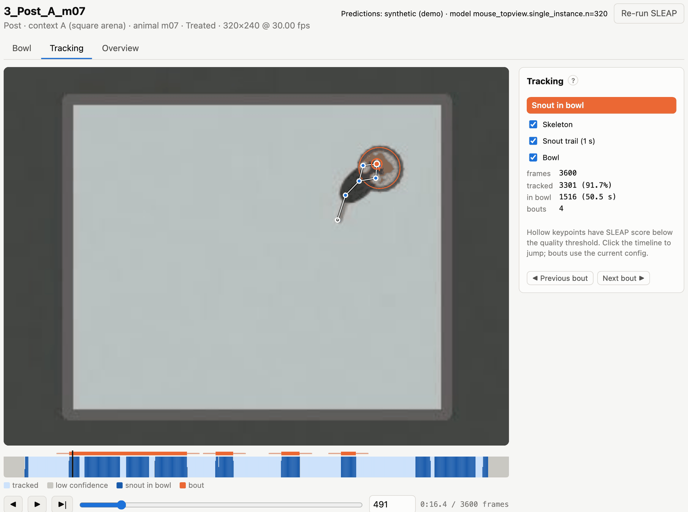
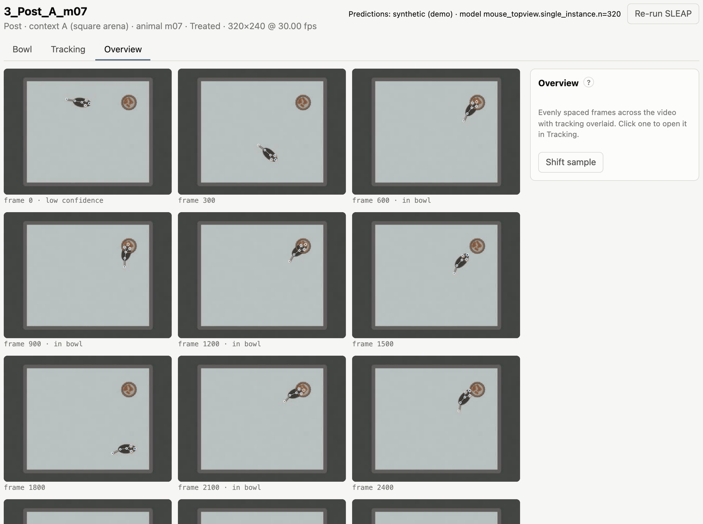

# Reviewing the tracking

Check the poses before you trust the numbers. The **Tracking** tab plays a video with its predictions overlaid, and
shows which frames the analysis will use and where it found contacts and bouts. The **Overview** tab samples frames
across the whole video at once.

## Tracking view

*Tracking: skeleton, bowl rim and snout trail on the frame; the timeline below; the summary and bout list on the
right.*

On the frame:

- **Skeleton:** keypoints joined by the skeleton's edges. A **hollow** keypoint has a SLEAP score below
  `quality.min_score` for that frame.
- **Bowl:** the annotated rim (orange) and its centre.
- **Snout trail:** the last second of the contact keypoint's positions.

Turn each overlay on or off with the checkboxes. The chip above them describes the current frame: *tracked*, *low
confidence* (excluded from the analysis) or *in bowl*.

Playback:

| Control | Effect |
|---|---|
| ▶ / <kbd>Space</kbd> | play or pause |
| ◀ / ▶︎\| / <kbd>←</kbd> <kbd>→</kbd> | step back or forward by *Step* frames |
| *Step N frames every T s* | playback speed: e.g. 15 frames every 0.15 s ≈ 3× real time at 30 fps |
| slider, frame box | jump to a frame (the time is shown next to it) |
| *Zoom* | 1×, 2× or 4×, centred on the bowl |

The address bar keeps the video, tab and frame (e.g. `#3_Post_A_m07/track/1520`), so you can bookmark a frame or send
the link to a colleague who has the same project.

## Timeline

The bar under the video summarises the whole recording:

| Colour | Meaning |
|---|---|
| light blue | tracked frames, used by the analysis |
| grey | low-confidence frames, excluded |
| dark blue | the contact keypoint is inside the bowl rim |
| orange bars (below) | detected bouts, from the start of the approach to the end of the withdrawal |

Click the timeline to jump there. The panel on the right lists frames, tracked frames, frames in the bowl and the
number of bouts. **◀ Previous bout** and **Next bout ▶** jump to the first contact of the previous or next bout. The bouts are detected with the project's
current settings, so after changing `bouts.*` in `feeding.yaml` you can check their effect here before running the
analysis.

> Before the bowl is annotated, only the tracking quality is shown; contacts and bouts need the rim.

## Overview sheet

*Overview: twelve frames spread over the video, with the tracking drawn on each. Captions mark frames that are in
the bowl or have low confidence.*

The Overview tab shows twelve evenly spaced frames with the skeleton and bowl drawn on them. It is a quick way to
spot problems: a model that loses the animal in one corner, swapped body parts, or a bowl that moved during the
recording. **Shift sample** shows a different set of frames. Click a frame to open it in the Tracking tab.

## Quality filtering

Not every frame is used. A frame is **tracked** (used) when the SLEAP confidence of *every* keypoint, averaged over a
centred window, is high enough. The average smooths over brief dips, while longer stretches of poor tracking are
dropped:

| Setting (`quality.*`) | Default | Meaning |
|---|---|---|
| `drop_nodes` | `[]` | keypoints ignored for filtering and features (e.g. an unreliable tail tip) |
| `score_window` | 300 frames | width of the centred rolling mean of each keypoint's score |
| `min_score` | 0.5 | a frame is kept when every keypoint's rolling mean is at least this |
| `min_segment_frames` | 90 | tracked stretches shorter than this are discarded |
| `max_interp_gap` | 0 | fill gaps of missing coordinates up to this many frames by linear interpolation (0 = off) |

The first and last `score_window / 2` frames of a video are never tracked, because the rolling window is incomplete
there.

If too much of a video is grey on the timeline:

- **Check the poses** in the Tracking tab. If they look right but scores are low, lower `min_score` or drop a keypoint
  that is often hidden (`drop_nodes`).
- **If the poses are wrong**, the model needs more training data from this setup: label frames from such videos in
  SLEAP and retrain.
- **Re-run SLEAP** with a lower peak threshold (*Settings → SLEAP inference*) if keypoints are missing outright.

The fraction of tracked frames is reported per video (`valid_fraction` in the Results → Videos tab). Use it to spot
videos that are tracked too poorly; re-run them, or leave them out of a comparison (see
[Comparisons](10-comparisons.md)) or of the run (`feeding analyze VIDEO…` analyses only the listed videos).
