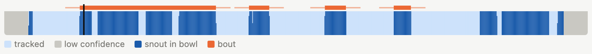

# Running the analysis

Click **Run analysis** in the top bar (or run `feeding analyze`). Every video that has both predictions and a bowl
annotation is analysed; videos missing either are skipped and listed in the run's details. A run takes from seconds
to a few minutes depending on the number and length of the videos. Figures account for most of the time:
`feeding analyze --no-plots` skips them.

## What the analysis does

For each video:

1. **Load the poses** and apply the [quality filter](07-tracking.md#quality-filtering): only *tracked* frames are used.
2. **Find contact.** A tracked frame is *in the bowl* when the contact keypoint (`bouts.node`, default `Snout`) is
   inside the annotated rim.
3. **Detect bouts** and **compute bout features** (below).
4. **Compute session measures**, including locomotion.
5. **Compute an occupancy map**: a 2-D histogram of the contact keypoint's position around the bowl centre, used for
   the group maps.

Then, for the whole run:

6. **Comparisons:** statistics and figures for the standard comparison and for every comparison you defined (see
   [Comparisons](10-comparisons.md)).
7. **Exploratory analyses:** PCA (and UMAP, if installed), local clustering and a random-forest classifier; see
   [Results](09-results.md#exploratory).
8. **Figures** per animal and per feature.
9. **The run folder** with tables, figures, a copy of `feeding.yaml` and a manifest (see [Output files](14-outputs.md)).

Per-video results are cached (`data/derived/`), keyed on the predictions, the bowl annotation and the analysis
settings. Unchanged videos are therefore not recomputed, and any change to their inputs is picked up automatically.

## Contact and bouts



*A bout on the Tracking timeline: the orange bar spans approach, contact (with a brief step-back) and withdrawal.*

A **bout** is one visit to the food:

```
 … away … | approach | contact ~ step back ~ contact … | withdrawal | … away …
          ^ window_start  ^ contact_start      contact_end ^      window_end ^
```

1. **Contact episodes** are runs of consecutive in-bowl frames within one tracked stretch.
2. Episodes separated by fewer than `merge_gap_frames` (default 90) non-contact frames are **merged into one bout**.
   Each extra episode counts as a **return**: the animal stepped back and came back to the food.
3. A bout is kept only if at least one of its episodes lasts at least `min_contact_frames` (default 15) consecutive
   frames. Brief touches of the rim don't count.
4. A bout needs `flank_frames` (default 90) tracked, contact-free frames **before and after** it. They are its
   **approach** and **withdrawal** windows, and they make sure both are fully observed.

| Setting (`bouts.*`) | Default | Meaning |
|---|---|---|
| `node` | `Snout` | keypoint whose position defines contact |
| `margin_px` | 0 | grow (positive) or shrink (negative) the rim by this many pixels for the contact test |
| `min_contact_frames` | 15 | shortest continuous contact that makes a bout |
| `merge_gap_frames` | 90 | shorter away-periods are returns within one bout |
| `flank_frames` | 90 | length of the approach and withdrawal windows |

Frame counts are in video frames; at 30 fps, 90 frames are 3 seconds.

## Bout features

One row per bout in `bout_features.csv`. Speeds are in pixels per frame. Angles are in degrees between each movement
step of the contact keypoint and the direction to the bowl centre: 0° = straight at the bowl, 180° = straight away.

| Feature | Meaning |
|---|---|
| `approach_indirectness` | standard deviation of that angle during the approach: how much the path wanders on the way in |
| `withdrawal_indirectness` | the same during the withdrawal |
| `approach_heading_mean` | mean angle during the approach: low = heads straight for the bowl |
| `num_returns` | contact episodes in the bout minus one |
| `num_interaction_frames` | frames from the first to the last contact of the bout |
| `interaction_duration_s` | the same in seconds |
| `contact_frames` | frames actually in contact (excludes step-backs) |
| `contact_fraction` | `contact_frames / num_interaction_frames` |
| `{node}_{phase}_speed_mean` | mean step length of a keypoint during the approach, interaction or withdrawal |
| `{node}_{phase}_speed_std` | its standard deviation |

Speeds are computed for every keypoint in `features.speed_nodes` (default: every tracked keypoint).

## Session measures

One row per video in `sessions.csv`. A session recorded in several parts (see
[Naming videos](04-projects.md#naming-videos)) is combined into one session before the statistics.

| Measure | Meaning |
|---|---|
| `valid_fraction` | fraction of frames that passed the quality filter |
| `in_bowl_time_s` | time with the contact keypoint in the bowl |
| `in_bowl_fraction_of_valid` | the same as a fraction of tracked frames |
| `latency_to_first_contact_s` | time from the start of the video to the first contact |
| `n_bouts` | number of bouts |
| `bouts_per_valid_min` | bouts per minute of tracked time |
| `mean_bout_frames` | mean bout length (first to last contact) |
| `n_frames`, `valid_frames`, `in_bowl_frames` | frame counts, kept for reference (not tested) |

### Locomotion

Whole-session movement of one body keypoint, `features.body_node`. The default is a body-centre keypoint (`MidBack`,
`Centroid`, `Thorax`, … if the skeleton has one), else the first speed keypoint. Positions are smoothed with a 5-frame
moving average within each tracked stretch, so tracking jitter does not count as movement.

| Measure | Meaning |
|---|---|
| `{body}_distance_px` | total distance travelled over tracked frames |
| `{body}_speed_mean` | mean speed (px/frame) |
| `{body}_speed_p90` | 90th percentile of speed: how fast the animal moves when it moves |
| `{body}_moving_fraction` | fraction of tracked frames faster than `features.moving_speed` (default 1 px/frame) |
| `{body}_moving_speed_mean` | mean speed while moving |
| `{body}_bowl_distance_mean` | mean distance from the bowl centre |

> **Pixels.** Distances and speeds are in image pixels. They are comparable between videos recorded with the same
> camera geometry. If the camera distance or resolution differs between groups, compare ratios or normalised measures
> instead.

## Figures

With figures enabled, a run draws:

- **Per comparison:** an overview heatmap of effect sizes, a box plot per feature, occupancy maps and a PCA (see
  [Results](09-results.md#comparisons)).
- **Per animal and context:** a heatmap of where the contact keypoint was around the bowl, and two "tornado" plots
  (position over time, coloured by distance to the bowl or by speed), with one panel per session in recording order.
- **Per feature:** a box plot of every animal's bouts by condition (and context).
- **Exploratory:** projections coloured by group, condition and context; local clustering; random-forest feature
  importances.

All figures are PNG files in the run folder, viewable in **Results** and included in **Export all (.zip)**.

## When something is missing

The run's notes (shown at the top of Results) explain what could not be computed and why. Examples:

- **No comparisons:** the standard comparison needs animals in at least two groups and two conditions. Add groups in
  *Settings → Animals and groups*, or define your own comparison.
- **No exploratory analyses:** these need at least 10 bouts from the analysed conditions.
- **No bouts:** check the bowl annotations and the tracking (and `bouts.margin_px`, `min_contact_frames`).

Per-animal figures and session measures are produced even for a single video.
