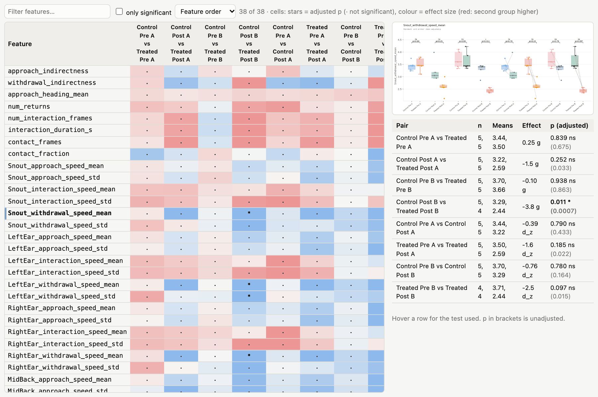
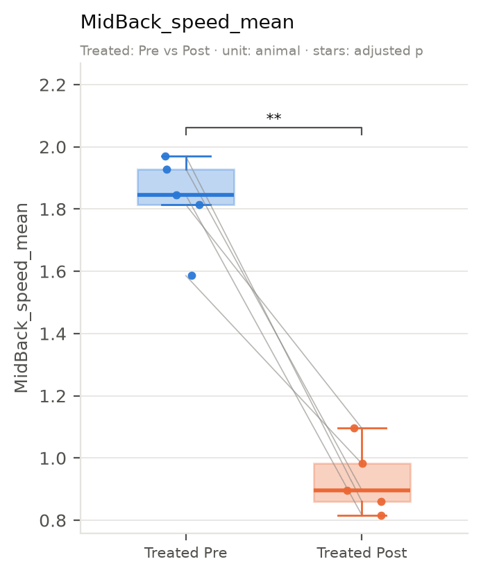
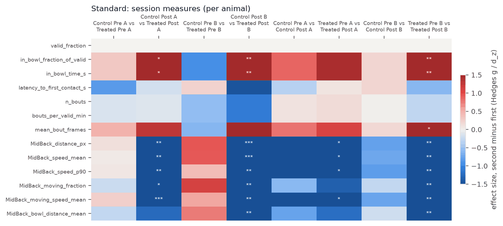
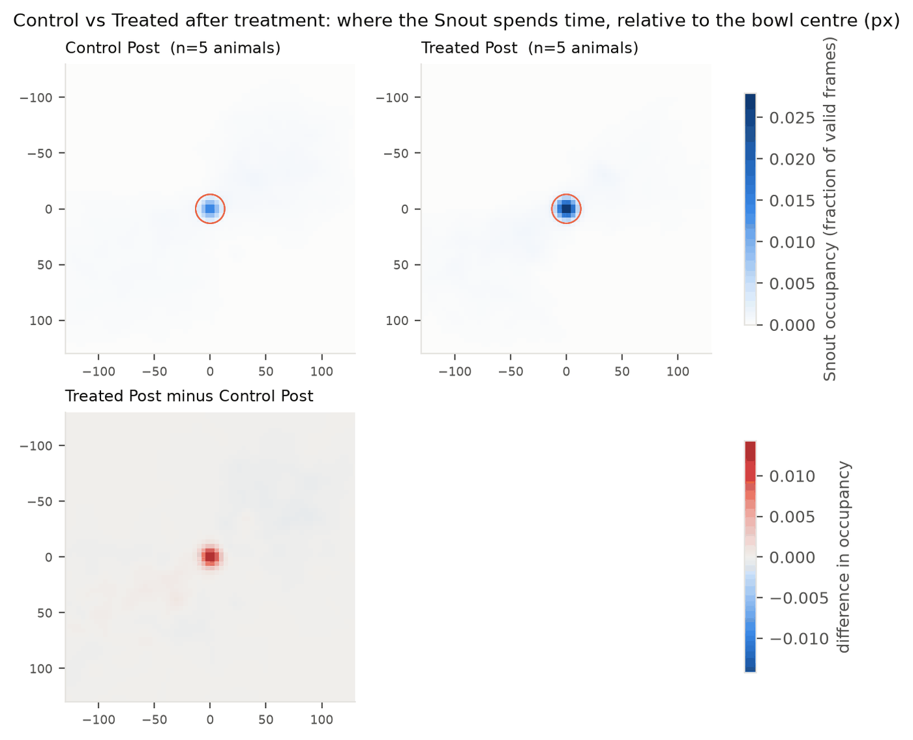
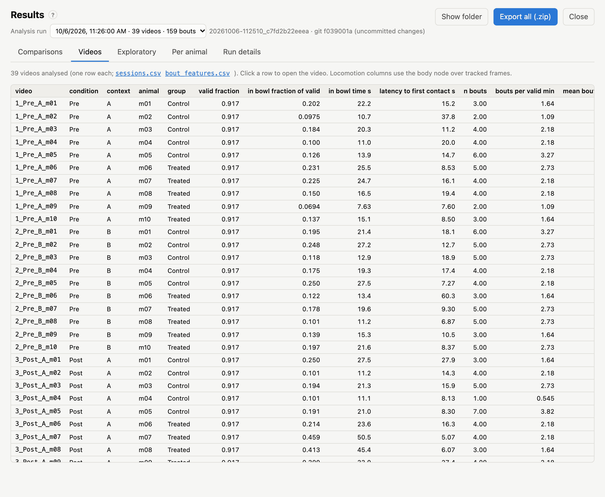
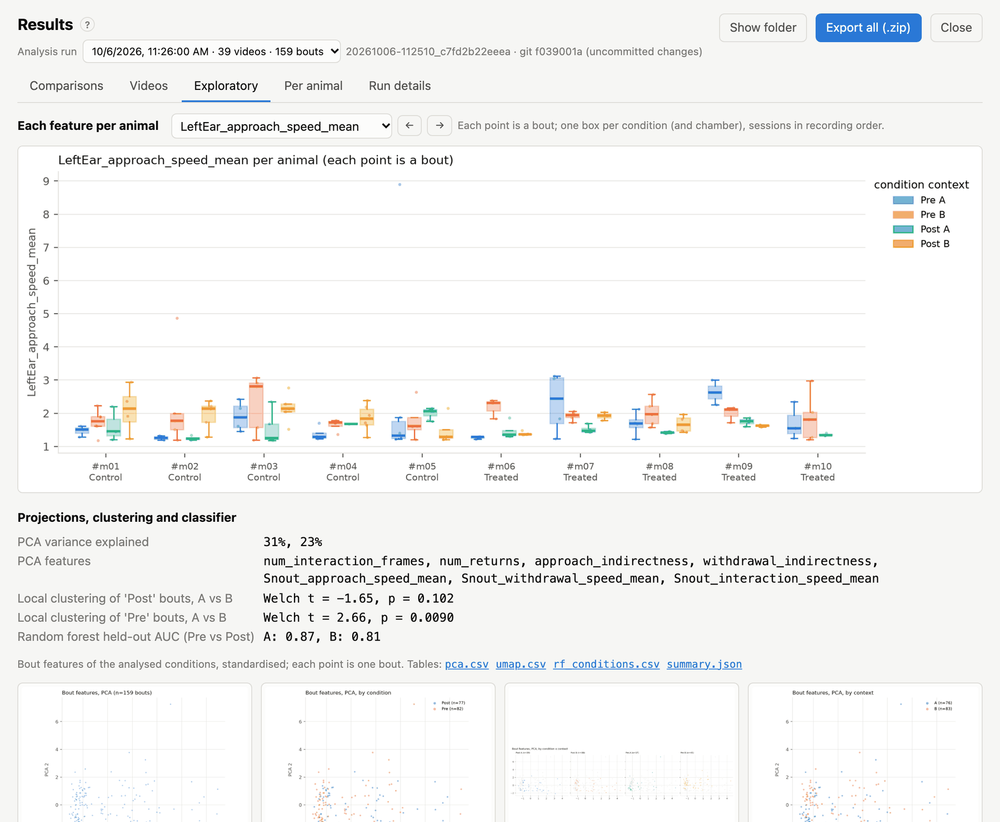
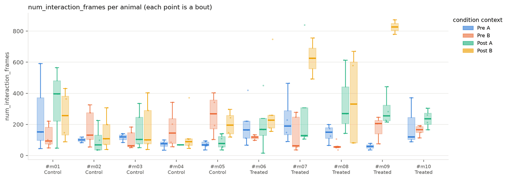
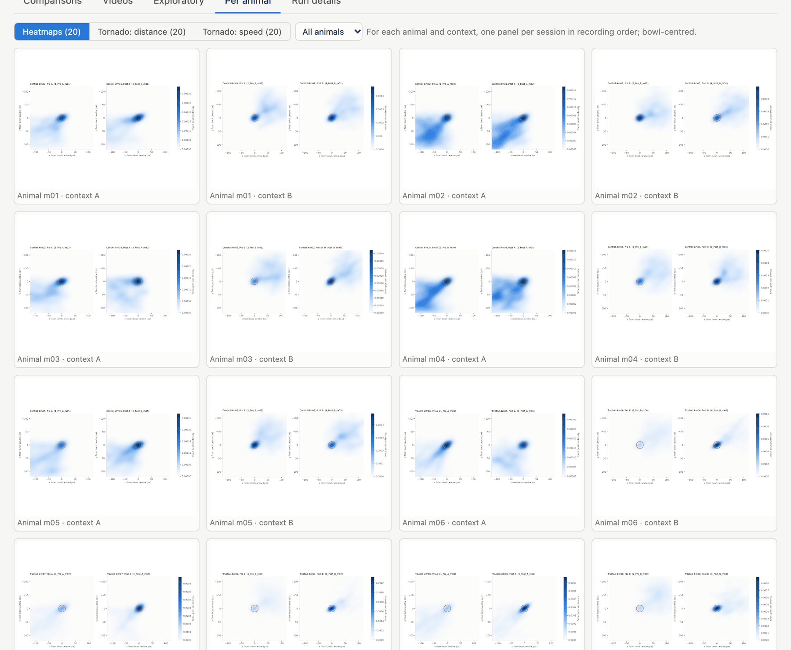
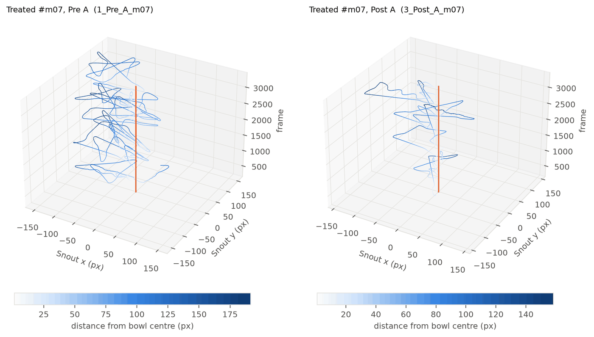
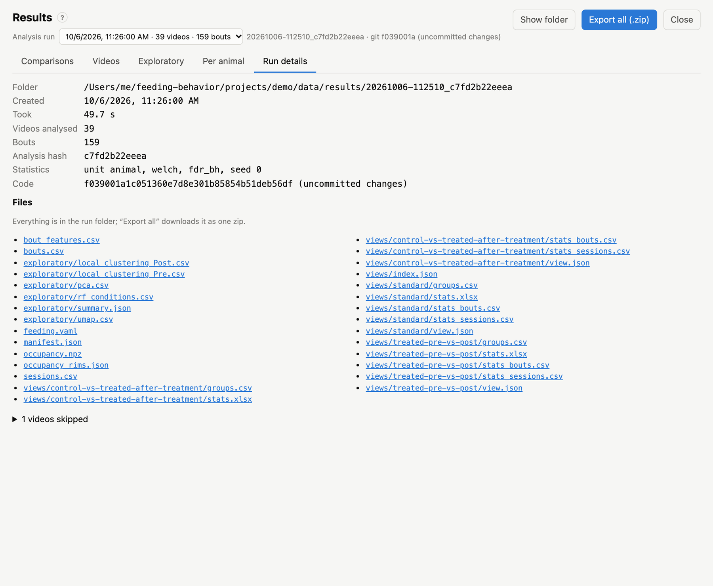

# Results

**Results** in the top bar shows the analysis runs of the open project. Pick a run in **Analysis run** (the newest is
selected). Runs are named `<date>-<time>_<settings hash>`; next to the name is the code version (git commit) that made
the run. The video list stays on the left, so you can jump between results and videos.

- **Export all (.zip)** downloads the whole run: tables, Excel workbooks, figures and the manifest.
- **Show folder** opens the run folder in Finder, Explorer or your file manager.

The address bar keeps the run, tab and comparison (`#results/<run>/compare/<comparison>`), so a view can be
bookmarked.

## Comparisons

*Results → Comparisons: the comparison list, the groups, figure thumbnails, the statistics grid, and the selected
feature's box plot and numbers.*

The row of cards at the top lists the comparisons:

- the built-in **Standard** comparison;
- the comparisons you defined, each showing how many of its results are significant in this run.

**+ New comparison** opens the editor (see [Comparisons](10-comparisons.md)). A comparison that is saved but has not
been run on the selected analysis can be run with **Run on this analysis**, or all at once with **Run all not yet run
on this analysis**. This takes seconds; the videos are not re-processed.

For the selected comparison:

- **Groups table:** each group's definition, and how many animals, sessions, videos and bouts it matched in this run.
  Hover over the animal count to see the IDs. A group with no analysed videos is flagged, and its tests stay empty.
- **Method line:** the unit of analysis, the test, the correction and the effect size used.
- **Figure strip:** the overview heatmaps, occupancy maps and PCA. Click a figure to enlarge it; use <kbd>←</kbd>
  <kbd>→</kbd> to browse.
- **Bout features / Session & locomotion:** the two families of measures, tested separately.
- **Statistics grid:** one row per feature, one column per pair of groups. A cell shows the significance stars of the
  *adjusted* p-value (`·` = not significant, `–` = not testable). Its colour shows the effect size: red when the
  second group is higher, blue when it is lower. Hover over a cell for the means, n, test and p-values. Comparisons
  with three or more groups and no explicit pairs also get an **All groups** column: one test across all groups.
- **Filter features…**, **only significant**, and sorting by **Smallest p first** narrow the grid.
- **Detail:** click a row to see the feature's box plot, and a table with n, means, effect size, adjusted p and (in
  brackets) the unadjusted p for every pair.

*The statistics grid of the standard comparison (bout features) with one feature selected: its box plot over all
pairs, and the numbers per pair.*

Stars: `*` p < 0.05, `**` p < 0.01, `***` p < 0.001, `****` p < 0.0001, after adjustment.

**Edit** changes a comparison (for the built-in one: **Copy and edit**); **Re-run** recomputes it; **Excel** downloads
its workbook; **Download (.zip)** downloads its folder. If a comparison was edited after this run's results were made,
a notice offers to re-run it.

### Comparison figures

*Box plot of one feature across the pairs of a comparison. Each dot is an animal (or a bout, with `unit: bout`);
lines join the same animal in paired tests; brackets give the adjusted p.*

| Figure | What it shows |
|---|---|
| `overview_bouts.png`, `overview_sessions.png` | effect size of every feature (rows) for every pair (columns), with stars: the whole comparison at a glance |
| `boxplots_bouts/<feature>.png`, `boxplots_sessions/<feature>.png` | one box plot per feature, as above |
| `occupancy.png` | where the contact keypoint was around the bowl, per group (each animal's map normalised, then averaged), and the difference between the groups of each pair |
| `pca.png` | the bouts of the groups on the first two principal components of the main bout features |

*Overview heatmap: effect sizes (colour) and significance (stars) for every feature and pair.*

*Occupancy around the bowl (centre, rim outlined) per group, and the difference between groups (red: more time in the
second group).*

## Videos

*Results → Videos: one row per analysed video, with its session and locomotion measures.*

The numbers per video (from `sessions.csv`): tracked fraction, time in the bowl, latency, bouts and locomotion. Click
a row to open that video. Use it to find outliers, such as a video with little tracking or no bouts.

## Exploratory

*Results → Exploratory: per-animal box plots of each feature, then the multivariate analyses.*

**Per-animal box plots.** Pick a feature (or step through them with <kbd>←</kbd> <kbd>→</kbd>). Every animal gets one
box per condition (and context), drawn from its bouts. This shows whether an effect is consistent across animals or
driven by a few.

*One feature for every animal, by condition and context.*

The **multivariate analyses** use the bouts of the analysed conditions:

- **PCA (and UMAP)** of the main bout features: approach and withdrawal indirectness, returns, interaction length, and
  the contact keypoint's speed in each phase. Each projection is drawn coloured by group, by condition, by context and
  by condition × context, and per context by condition.
- **Local clustering:** for every bout, how many of its 31 nearest neighbours in the PCA come from the same
  condition, relative to chance. The two contexts are then compared with a Welch t-test. This asks whether a
  condition's bouts form a distinct cluster more in one context than the other.
- **Random forest:** classifies the first versus the last analysed condition from all bout features, per context.
  It reports the held-out ROC AUC (0.5 = chance) and the importance of each feature. Classes are balanced by
  oversampling, and everything is seeded.

The tables (`pca.csv`, `umap.csv`, `rf_conditions.csv`, `summary.json`) can be downloaded from this tab.

## Per animal

*Results → Per animal: heatmaps and tornado plots for each animal and context, one panel per session.*

For each animal and context, with one panel per session in recording order:

- **Heatmap:** the density of the contact keypoint's positions around the bowl centre, with the rim outlined.
- **Tornado plot (distance):** a 3-D plot of the keypoint's path in x and y (bowl-centred) against time (vertical
  axis, in frames). It is coloured by distance to the bowl centre, and the vertical line marks the bowl. Visits to the
  bowl show as excursions that reach the line.
- **Tornado plot (speed):** the same path coloured by speed.

*A tornado plot: position around the bowl (x, y) over time (vertical), one panel per session.*

## Run details

The run's provenance:

- its folder, when it ran and how long it took;
- the number of videos and bouts;
- the settings hash and the statistics settings;
- the code version (git commit, and whether there were uncommitted changes);
- every file of the run, as links;
- videos that were skipped, and why.

*Results → Run details.*

The run's `manifest.json` has more, including the full settings, package versions and input hashes (see
[Output files](14-outputs.md)).
