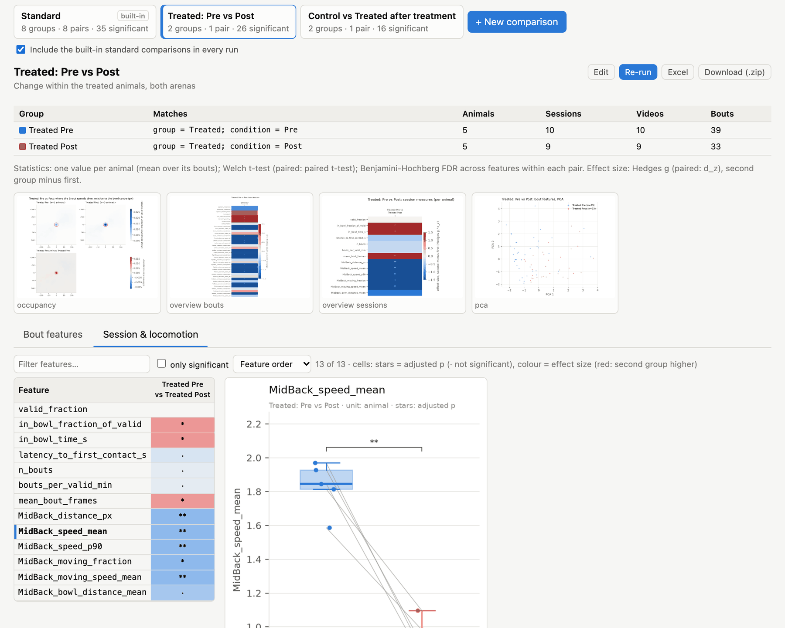

# Comparisons

A **comparison** (also called a *view*) puts two or more groups of videos side by side and tests every bout feature
and every session and locomotion measure between them. A group is defined by metadata, not by a fixed list of files.
For example, *"group = Treated, condition = Post, context = A"* matches every video with that metadata, including
videos you add later.

Comparisons only read a run's tables. Adding or editing one and running it on an existing analysis takes seconds,
without re-processing any video.

## The standard comparison

Every run includes a built-in **Standard** comparison, built from the project's groups, conditions and contexts.
Let the first and last analysed conditions be *Pre* and *Post*. It then tests:

- **between groups**, every pair of groups within each context × condition: *Control Pre A vs Treated Pre A*,
  *Control Post A vs Treated Post A*, and so on for each context;
- **within groups**, *Pre vs Post* within each context × group: *Control Pre A vs Control Post A*, … These tests are
  paired, because they compare the same animals.

The standard comparison needs at least two groups and two conditions. Turn it off for new runs with the checkbox
under the comparison list, or with `analysis.standard_view: false`. To change it, click **Copy and edit**: this
creates your own comparison with the same groups.

## Creating a comparison

In **Results → Comparisons**, click **+ New comparison**.


*The comparison editor. Each group lists its matching animals and videos (and how many are ready for analysis).*

1. **Name** the comparison (it is also used for its folder) and, optionally, describe it.
2. **Define each group** by clicking metadata values. Within one field, ticked values are alternatives (*condition =
   Pre or Post*). Across fields they must all hold (*group = Treated* **and** *condition = Post*). A field with
   nothing ticked matches anything. Under the label, the editor counts the animals and videos the group matches, and
   how many are *ready* (have predictions and a bowl). The count turns red when none are ready.
3. **Labels** are generated from the ticked values (e.g. *Treated Post*). Type your own if you prefer.
4. **+ Add group** adds another group. **One group per [field] → Add** splits the last group into one group per value
   of a field. For example, tick *condition = Post*, then add one group per *group*, to get *Control Post* and
   *Treated Post*.
5. Rarely used fields (animal, session, part) are under **more fields**. Use them to compare individual animals or
   specific sessions.
6. Choose **Pairs to test**:
   - **All pairs** tests every pair of groups. With three or more groups, it also runs one omnibus test across all
     groups.
   - **Choose pairs** tests only the pairs you tick, which keeps the multiple-comparison correction small.
7. Choose how pairs are **paired** (see below).
8. Click **Save and run on this analysis**, or **Save** to run it with the next analysis.

Comparisons are stored in `feeding.yaml`, so they are part of the project and are re-run with every new analysis.
**Delete comparison** removes one.



*A saved comparison, Treated: Pre vs Post, on the Session & locomotion measures. The same five animals are in both
groups, so the tests are paired, and the box plot joins each animal's two values.*

## Paired and independent tests

When the statistics are per animal (`analysis.unit: animal`, the default), two groups can contain the same animals.
Pre vs Post in one group is the typical case. Such groups are compared with **paired** tests over the animals present
in both groups. These tests are more sensitive and correct for repeated measures.

| Setting | Behaviour |
|---|---|
| **Automatic** (default) | paired when at least two animals, and at least half of the smaller group, are in both groups |
| **Always** | paired over the shared animals whenever there are at least two |
| **Never** | always independent groups |

Animals that are in only one group are left out of a paired test. The n reported for each pair is the number of
values actually tested. See [Statistical methods](11-statistics.md) for the tests themselves.

## Examples

**Treatment effect after treatment, both arenas pooled:**

| Group | group | condition |
|---|---|---|
| Control Post | Control | Post |
| Treated Post | Treated | Post |

**Change within the treated animals, square arena only (paired automatically):**

| Group | group | condition | context |
|---|---|---|---|
| Pre | Treated | Pre | A |
| Post | Treated | Post | A |

**Arena effect in every animal at baseline:**

| Group | condition | context |
|---|---|---|
| Square | Pre | A |
| Round | Pre | B |

**Three groups across days.** Use one group per *session*, choose *All pairs*, and the omnibus test (*All groups*
column) tests for any difference across days, alongside the pairwise tests.

**Excluding an animal.** Groups only include matching videos, so to leave one animal out, tick all the other animals
under *more fields → animal*.

## In feeding.yaml

The editor writes comparisons under `views:`. You can also write them by hand:

```yaml
views:
  - name: Treated, Pre vs Post (arena A)
    description: Paired change within treated animals
    groups:
      - {label: Pre, where: {group: [Treated], condition: [Pre], context: [A]}}
      - {label: Post, where: {group: [Treated], condition: [Post], context: [A]}}
  - name: Control vs Treated after treatment
    groups:
      - {label: Control, where: {group: [Control], condition: [Post]}}
      - {label: Treated, where: {group: [Treated], condition: [Post]}}
    pairs: [[Control, Treated]]     # optional; default: all pairs
    paired: no                      # auto (default) | yes | no
```

`where` fields are `group`, `condition`, `context`, `chamber`, `animal`, `session`, `part` and `video`. Each takes a
list of allowed values.

## From the command line

```bash
feeding compare                         # run every comparison on the latest analysis run
feeding compare 20260301-101500_ab12cd  # on a given run
feeding compare -v "Treated, Pre vs Post (arena A)"   # only this comparison (name or folder name)
feeding compare --no-plots              # statistics only
```

Each comparison writes a folder `views/<name>/` in the run; see [Output files](14-outputs.md#comparison-folders).
